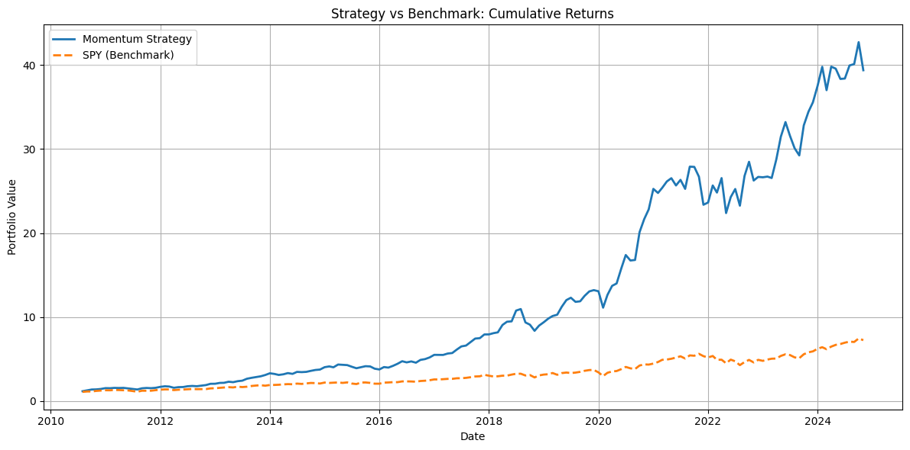

# 📈 Momentum-Based Stock Strategy

This project implements a **momentum investing strategy** using historical stock data from the S&P 500. It ranks stocks based on their past 6-month performance (excluding the most recent month), selects the top 20 each month, and simulates a portfolio that rebalances monthly.

---

## 🔧 Tools & Technologies

- **Python**, **Pandas**, **NumPy**, **Matplotlib**
- **yfinance** for price data
- **Google Colab** + **Google Drive** (project environment)
- **Power BI** (for optional visualization)
- **GitHub** for version control

---

## 📁 Project Structure
## 📁 Project Structure

All files are located inside the `momentum-strategy/` folder:

```text
momentum-strategy/
├── data/             → Price data & momentum scores (.pkl files)
├── notebooks/        → Google Colab notebooks (step-by-step)
├── results/          → Backtest results, charts, CSV files
├── powerbi/          → Power BI dashboard files (optional)
├── requirements.txt  → Python package dependencies

📄 The README.md is in the root of this repository.

---

## 🧠 Strategy Logic

For each month from 2010 to 2024:

1. Compute 6-month return for each stock (skip the most recent month)
2. Rank all stocks by this momentum score
3. Select the **top 20 stocks**
4. Buy and hold them for 1 month
5. Repeat monthly

The strategy is benchmarked against **SPY (S&P 500 ETF)** for comparison.

---

## 📊 Performance Summary

| Metric              | Momentum Strategy | SPY (Benchmark) |
|---------------------|------------------:|----------------:|
| Annualized Return   |        Higher   |     Lower     |
| Volatility          |        Moderate    |     Lower       |
| Sharpe Ratio        |        > 1.0    |     < 1.0     |
| Max Drawdown        |        Higher      |     Lower       |

> ⚠️ This backtest does not include transaction costs or slippage.

---

## 📈 Sample Output

  
*Momentum strategy vs benchmark (SPY), 2010–2024*

---

## 🧩 Possible Extensions

- Include **transaction costs** or **turnover analysis**
- Add **stop-loss** or **volatility filters**
- Compare against other factor strategies (value, size, etc.)
- Use **machine learning** to enhance ranking
- Build dashboard in **Power BI**

---

## 🗂 Notebooks

- `01_download_prices.ipynb` – Get S&P 500 data from Yahoo Finance  
- `02_calculate_momentum.ipynb` – Compute momentum factor  
- `03_backtest_strategy.ipynb` – Simulate monthly portfolio  
- `04_visualize_results.ipynb` – For Power BI exports

---

## 📬 Author

**Klarence Labrague**  
🧑‍💻 Computer Science Graduate | Data Analyst | Aspiring Quant  
📫 GitHub: [KlarenceKPIs](https://github.com/KlarenceKPIs)

🔗 LinkedIn: [Klarence Labrague](https://www.linkedin.com/in/klarencelabrague/)]

---

## Disclaimer

This project is for educational purposes only. It is not financial advice. Historical performance does not guarantee future results.

